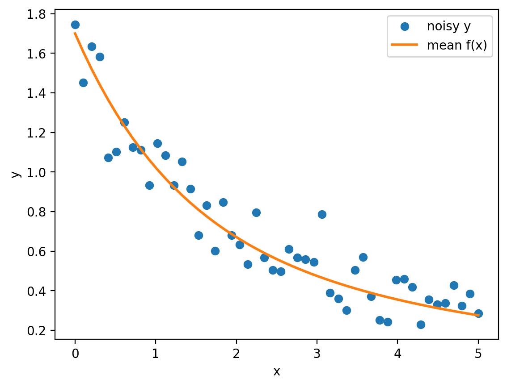

## Instructions
This homework explores neural estimation and conformal inference for a nonlinear regression model.

```{r setup-check, message=FALSE, warning=FALSE}
dat <- read.csv("results/sim_example.csv")
head(dat)
```

```{r fig-check, echo=FALSE, out.width="60%", fig.align="center"}

```


## Problem 1

## Problem 2

## Problem 3

## Problem 4
