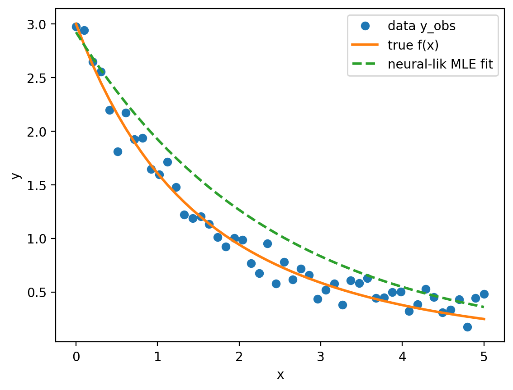
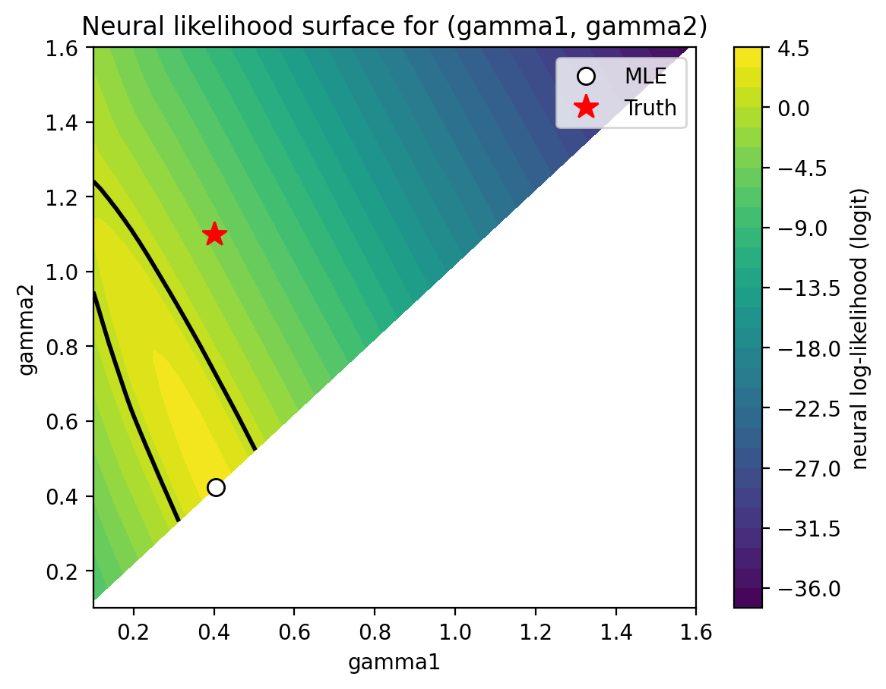

## Instructions
This homework explores neural estimation and conformal inference for a nonlinear regression model.


## Problem 1

We trained a neural Bayes estimator to map the standardized observation vector $y \in \mathbb{R}^{50}$
to the parameter vector $\theta=(\beta_1,\gamma_1,\beta_2,\gamma_2)$ using simulated training pairs.
To quantify uncertainty for the single observed curve, we used a residual bootstrap with 100 resamples.

```{r prob1-table, echo=FALSE, message=FALSE, warning=FALSE}
summ <- read.csv("results/prob1_summary.csv")
param <- scan("results/prob1_param_names.txt", what="character")

out <- data.frame(
  Parameter = param,
  Estimate = summ$theta_hat,
  BootMean = summ$boot_mean,
  BootSD = summ$boot_sd,
  CI2.5 = summ$ci2.5,
  CI97.5 = summ$ci97.5
)

out_num <- out
out_num[,-1] <- round(out_num[,-1], 3)

knitr::kable(out_num, caption = "Neural Bayes estimate and bootstrap uncertainty (B=100).")

```


```{r prob1-band, echo=FALSE, out.width="75%", fig.align="center"}
knitr::include_graphics("figs/prob1_fit_band.png")
```


## Problem 2

### Settings (Neural Likelihood)

- Model: \(y(x)=\beta_1 e^{-\gamma_1 x} + \beta_2 e^{-\gamma_2 x} + \epsilon\), \(\epsilon \sim N(0,\sigma^2)\), \(\sigma=0.1\).
- Design points: \(x\) is a fixed grid of 50 points on \([0,5]\).
- Prior (training simulations): \(\beta_1,\beta_2 \sim \text{Unif}(0.5,2.5)\), \(\gamma_1,\gamma_2 \sim \text{Unif}(0.1,1.6)\) with identifiability constraint \(\gamma_1<\gamma_2\).
- Training data: \(N=60{,}000\) simulated pairs.
- Classifier architecture: fully-connected network (54 → 128 → 128 → 1) with ReLU.
- Training: Adam (lr=1e-3), batch size 512, epochs 8; response curves standardized using global mean/std from the simulated training set.
- MLE search: multi-start gradient ascent over a constrained parameterization (via sigmoid map to bounds and sorting to enforce \(\gamma_1<\gamma_2\)); warm-started using Problem 1 estimate.


```{r prob2-table, echo=FALSE}
theta2 <- read.csv("results/prob2_theta.csv")
metrics2 <- read.csv("results/prob2_metrics.csv")

# round numeric columns only
num_cols <- sapply(theta2, is.numeric)
theta2[num_cols] <- round(theta2[num_cols], 3)

knitr::kable(theta2, caption="Problem 2: Neural-likelihood approximate MLE and truth.")

knitr::kable(metrics2, digits=3, caption="Problem 2: Likelihood-ratio diagnostic at the truth.")
```

```{r prob2-fit, echo=FALSE, out.width="75%", fig.align="center"}


```


### Conclusion

We trained a neural likelihood classifier to distinguish *paired* samples \((y,\theta)\sim p(y\mid\theta)p(\theta)\) from *mismatched* samples obtained by permuting \(\theta\). The classifier logit evaluated at the observed curve \(y_{\text{obs}}\) provides an approximation to the log-likelihood surface \(\ell(\theta; y_{\text{obs}})\) up to an additive constant. Maximizing this neural log-likelihood over a constrained parameterization (positivity and the identifiability constraint \(\gamma_1 < \gamma_2\)) yielded an approximate MLE
\[
\hat\theta_{\text{MLE}}=(\hat\beta_1,\hat\gamma_1,\hat\beta_2,\hat\gamma_2)=(0.678,\;0.405,\;2.245,\;0.423),
\]
with best logit value \(3.854\). The fitted response captures the overall exponential decay pattern in the data, but deviates from the true response for larger \(x\), suggesting that multiple parameter combinations can produce similar fitted curves in this two-exponential mixture model.

The two-dimensional neural likelihood surface over \((\gamma_1,\gamma_2)\) exhibits an elongated ridge concentrated near \(\gamma_1 \approx \gamma_2\), indicating weak identifiability of the two-exponential decomposition. This likelihood geometry explains why optimization can favor solutions with nearly equal decay rates and redistributed weights, even when the true decay rates are more separated. Uncertainty for \((\gamma_1,\gamma_2)\) was quantified using a likelihood-ratio (LR) region based on the grid-evaluated surface. The LR statistic at the true parameters is
\[
\text{LR}(\theta_{\text{true}})=3.263 < \chi^2_2(0.95)=5.99,
\]
so the true \((\gamma_1,\gamma_2)\) lies inside the 95\% LR region, consistent with the contour overlay in the likelihood surface plot.


## Problem 3

## Problem 4
