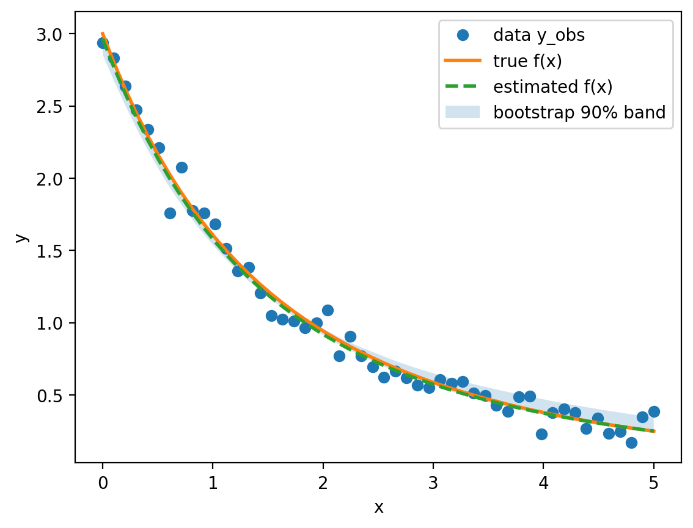

## Instructions
This homework explores neural estimation and conformal inference for a nonlinear regression model.


## Problem 1

We trained a neural Bayes estimator to map the standardized observation vector $y \in \mathbb{R}^{50}$
to the parameter vector $\theta=(\beta_1,\gamma_1,\beta_2,\gamma_2)$ using simulated training pairs.
To quantify uncertainty for the single observed curve, we used a residual bootstrap with 100 resamples.

```{r prob1-table, echo=FALSE, message=FALSE, warning=FALSE}
summ <- read.csv("results/prob1_summary.csv")
param <- scan("results/prob1_param_names.txt", what="character")

out <- data.frame(
  Parameter = param,
  Estimate = summ$theta_hat,
  BootMean = summ$boot_mean,
  BootSD = summ$boot_sd,
  CI2.5 = summ$ci2.5,
  CI97.5 = summ$ci97.5
)

out_num <- out
out_num[,-1] <- round(out_num[,-1], 3)

knitr::kable(out_num, caption = "Neural Bayes estimate and bootstrap uncertainty (B=100).")

```


```{r prob1-band, echo=FALSE, out.width="75%", fig.align="center"}

```


## Problem 2

## Problem 3

## Problem 4
